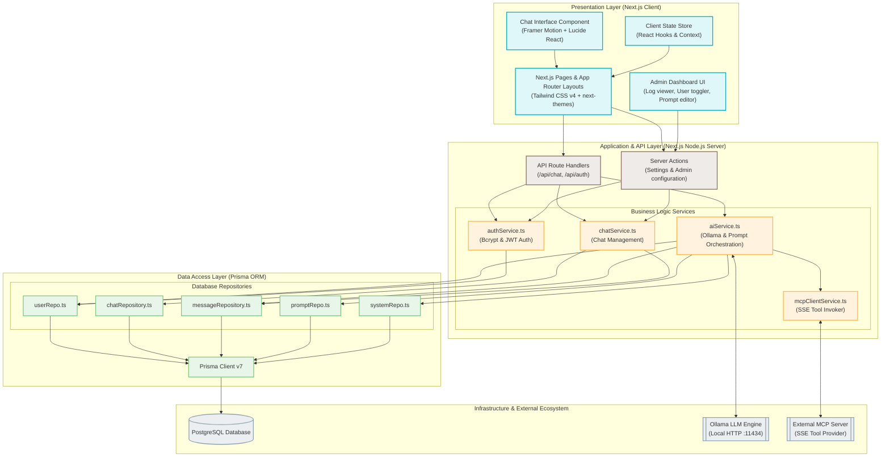
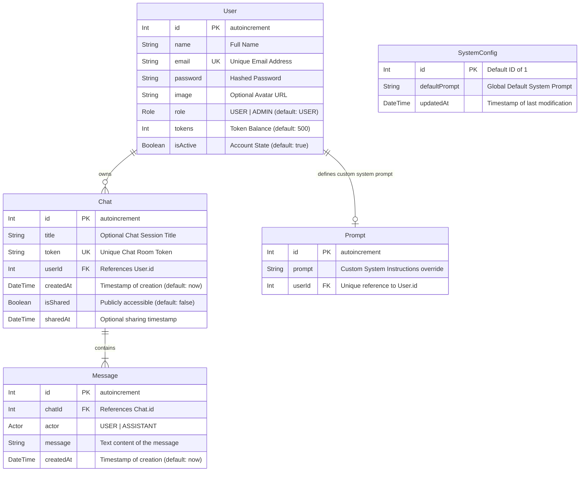
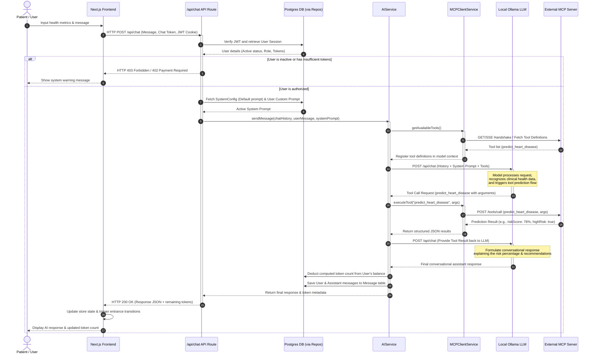
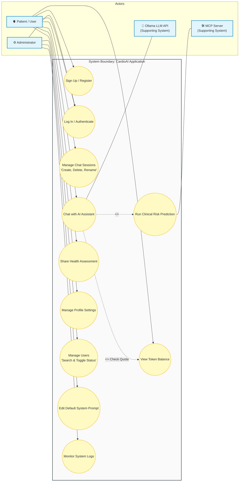
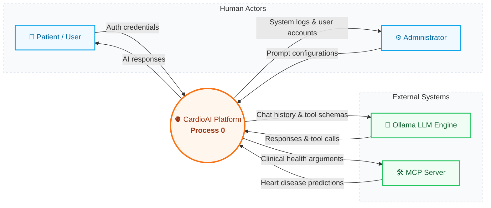
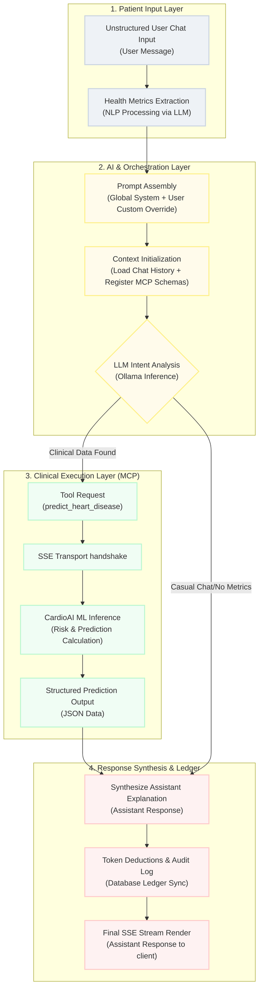
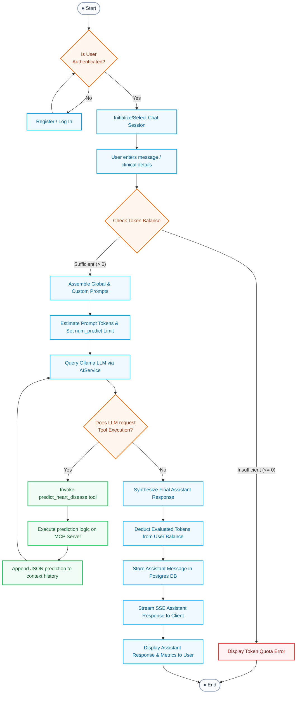

# 📊 CardioAI — System Diagrams & Architecture

This document contains high-fidelity Mermaid diagrams detailing the architectural, database, transactional, operational, and data flow layers of the **CardioAI** platform.

---

## 📋 Table of Contents

1. [System Architecture Diagram](#1-system-architecture-diagram)
2. [Database ER Diagram](#2-database-er-diagram)
3. [Sequence Diagram](#3-sequence-diagram)
4. [Use Case Diagram](#4-use-case-diagram)
5. [DFD Level 0 — Context Diagram](#5-dfd-level-0-context-diagram)
6. [Class Diagram](#6-class-diagram)
7. [System Integration & Prediction Methodology](#7-system-integration-prediction-methodology)
8. [UML Activity Diagram — Dynamic Token Auditing & num_predict](#8-uml-activity-diagram--dynamic-token-auditing--num_predict-generation-limits)

---

## 1. System Architecture Diagram

This diagram represents the multi-tiered architecture of CardioAI, highlighting the presentation (client), server-side application logic, data access, database, and third-party integration layers.

---

## 2. Database ER Diagram

A visual representation of the PostgreSQL schema defined in `prisma/schema.prisma`. It represents entities, unique identifiers, properties, and relationships.

---

## 3. Sequence Diagram

This sequence diagram outlines the entire request lifecycle of a conversational heart disease risk assessment, highlighting user authentication, token quota balance checks, prompt composition, dynamic MCP tool calls, Ollama response generation, and final database sync.

---

## 4. Use Case Diagram

This diagram maps system boundaries and shows how registered patients and administrative users interact with CardioAI's features, backed by local LLMs and MCP servers.

---

## 5. DFD Level 0 — Context Diagram

The Data Flow Diagram (DFD) Level 0 illustrates the boundary of the **CardioAI** platform, depicting a unified central system process interacting cleanly with human actors and external intelligent services.

---

## 6. Class Diagram

This UML Class Diagram represents the structural blueprint of the **CardioAI** platform, depicting the Psuedo object-oriented structure, repositories, business logic services, methods, and relationships.

```mermaid
classDiagram
    direction TB

    class AuthService {
        +signUp(data: SignUpData) static
        +signIn(data: SignInData) static
    }

    class AIService {
        +respond(chatId: number, userId: number) static
        +saveResponse(chatId: number, message: string) static
    }

    class MCPClientService {
        -instance: MCPClientService static
        -getClient() Client
        +getInstance() MCPClientService static
        +connect() void
        +listTools() Promise
        +predictHeartDisease(args: PredictHeartDiseaseArgs) Promise
        +callTool(name: string, args: Record) Promise
    }

    class ChatService {
        +create(data: CreateChat) static
        +getAll(userId: number) static
        +getById(id: number) static
        +getByToken(token: string) static
        +update(id: number, data: Partial) static
        +deleteById(id: number) static
        +deleteByToken(token: string) static
    }

    class MessageService {
        +create(data: CreateMessage) static
        +getAll(chatId: number) static
        +getById(id: number) static
        +update(id: number, data: Partial) static
        +deleteById(id: number) static
    }

    class AdminActions {
        -checkAdmin() Promise
        +updateGlobalPrompt(prompt: string) Promise
        +getGlobalPrompt() Promise
        +getLogs(page: number, pageSize: number, level: string, date: string) Promise
        +getAllUsers() Promise
        +toggleUserStatus(userId: number, isActive: boolean) Promise
        +updateUserTokens(userId: number, tokens: number) Promise
    }

    class UserRepo {
        +findByEmail(email: string) static
        +findById(id: number) static
        +createUser(data: UserCreateInput) static
        +updateUser(id: number, data: UserUpdateInput) static
        +findAll() static
        +updateStatus(id: number, isActive: boolean) static
        +checkTokenBalance(userId: number) static
        +deductTokens(userId: number, amount: number) static
        +setTokens(id: number, tokens: number) static
        +refundChatToken(userId: number) static
    }

    class ChatRepository {
        +create(data: CreateChat) static
        +getAll(userId: number) static
        +getById(id: number) static
        +getByToken(token: string) static
        +update(id: number, data: Partial) static
        +deleteById(id: number) static
        +deleteByToken(token: string) static
    }

    class MessageRepository {
        +create(data: CreateMessage) static
        +getAll(chatId: number) static
        +getById(id: number) static
        +update(id: number, data: Partial) static
        +deleteById(id: number) static
    }

    class PromptRepo {
        +findByUserId(userId: number) static
        +upsertPrompt(userId: number, prompt: string) static
    }

    class SystemRepo {
        +getDefaultPrompt() static
        +updateDefaultPrompt(prompt: string) static
    }

    %% Relationships
    AuthService ..> UserRepo : "authenticates via"
    AIService ..> MessageService : "reads/saves messages via"
    AIService ..> UserRepo : "checks/deducts tokens via"
    AIService ..> MCPClientService : "lists/calls tools via"
    ChatService ..> ChatRepository : "delegates DB ops"
    MessageService ..> MessageRepository : "delegates DB ops"
    AdminActions ..> UserRepo : "manages users/roles via"
    AdminActions ..> SystemRepo : "configures global default prompt via"

    %% Styling
    style AuthService fill:#e0f7fa,stroke:#00acc1,stroke-width:1.5px
    style AIService fill:#e0f7fa,stroke:#00acc1,stroke-width:1.5px
    style MCPClientService fill:#e0f7fa,stroke:#00acc1,stroke-width:1.5px
    style ChatService fill:#e0f7fa,stroke:#00acc1,stroke-width:1.5px
    style MessageService fill:#e0f7fa,stroke:#00acc1,stroke-width:1.5px
    style AdminActions fill:#efebe9,stroke:#8d6e63,stroke-width:1.5px

    style UserRepo fill:#e8f5e9,stroke:#81c784,stroke-width:1.5px
    style ChatRepository fill:#e8f5e9,stroke:#81c784,stroke-width:1.5px
    style MessageRepository fill:#e8f5e9,stroke:#81c784,stroke-width:1.5px
    style PromptRepo fill:#e8f5e9,stroke:#81c784,stroke-width:1.5px
    style SystemRepo fill:#e8f5e9,stroke:#81c784,stroke-width:1.5px
```

---

## 7. System Integration & Prediction Methodology

The CardioAI methodology utilizes a high-performance orchestration system that integrates local Large Language Models (LLMs) with standard clinical APIs. Below is the workflow detailing how raw chat conversations are dynamically enriched with structured medical inference.

### Technical Principles & Pipelines

1. **Information Ingestion & Sanitization**: Patient messages are streamed via Next.js routes. System filters custom settings & prompts to format context.
2. **Dynamic Tool Schema Injections**: The Model Context Protocol (MCP) server dynamically presents capabilities (like `predict_heart_disease`) to the LLM agent container using Server-Sent Events (SSE).
3. **Agentic Inference**: The local LLM processes conversation history. When structured clinical variables are detected in natural language, it executes the predictive tool model.
4. **PostgreSQL Ledger Auditing**: For each completed LLM iteration, prompt and completion tokens are measured and deducted from the patient's quota in real-time, providing strict rate limiting and monetization guardrails.

---

## 8. UML Activity Diagram — Dynamic Token Auditing & num_predict (Generation Limits)

This diagram displays the dynamic operational sequence of activities within the CardioAI application, representing actions, decisions, and system forks from user login to final stream response generation.

