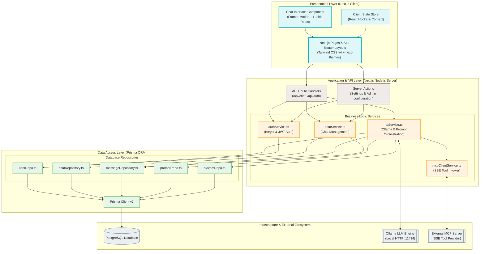
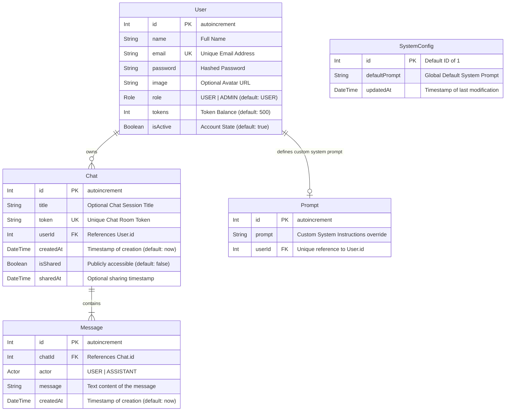
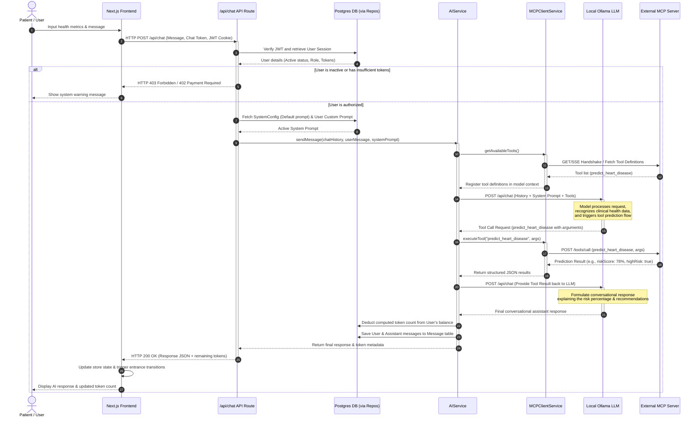
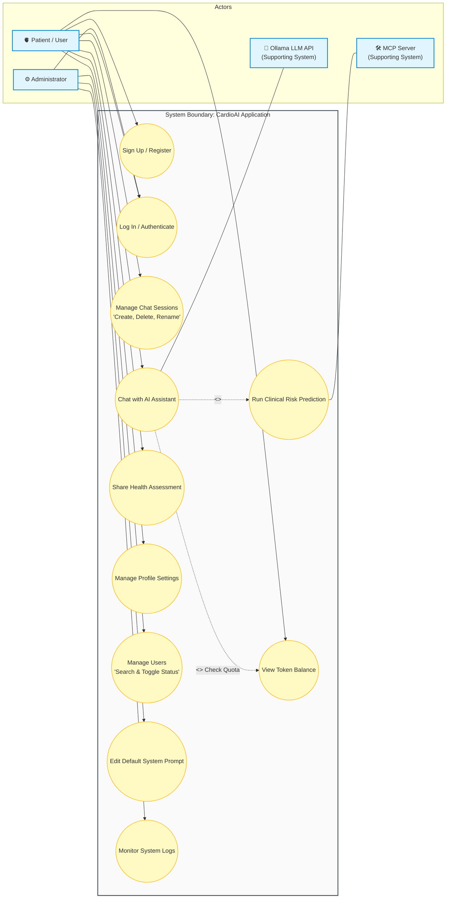
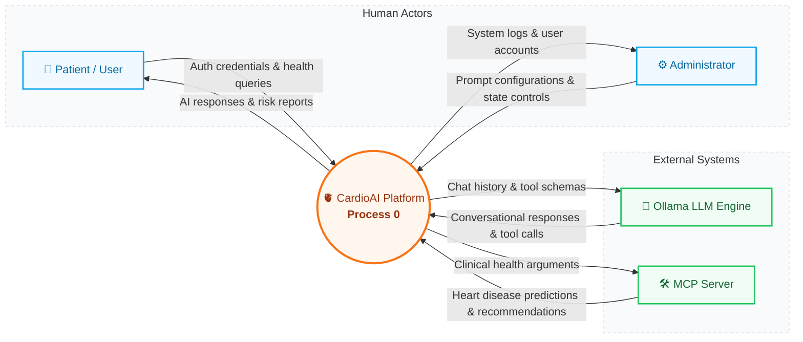

# 📊 CardioAI — System Diagrams & Architecture

This document contains high-fidelity Mermaid diagrams detailing the architectural, database, transactional, operational, and data flow layers of the **CardioAI** platform.

---

## 📋 Table of Contents
1. [System Architecture Diagram](#1-system-architecture-diagram)
2. [Database ER Diagram](#2-database-er-diagram)
3. [Sequence Diagram](#3-sequence-diagram)
4. [Use Case Diagram](#4-use-case-diagram)
5. [DFD Level 0 — Context Diagram](#5-dfd-level-0-context-diagram)

---

## 1. System Architecture Diagram

This diagram represents the multi-tiered architecture of CardioAI, highlighting the presentation (client), server-side application logic, data access, database, and third-party integration layers.

---

## 2. Database ER Diagram

A visual representation of the PostgreSQL schema defined in `prisma/schema.prisma`. It represents entities, unique identifiers, properties, and relationships.

---

## 3. Sequence Diagram

This sequence diagram outlines the entire request lifecycle of a conversational heart disease risk assessment, highlighting user authentication, token quota balance checks, prompt composition, dynamic MCP tool calls, Ollama response generation, and final database sync.

---

## 4. Use Case Diagram

This diagram maps system boundaries and shows how registered patients and administrative users interact with CardioAI's features, backed by local LLMs and MCP servers.

---

## 5. DFD Level 0 — Context Diagram
 
The Data Flow Diagram (DFD) Level 0 illustrates the boundary of the **CardioAI** platform, depicting a unified central system process interacting cleanly with human actors and external intelligent services.

